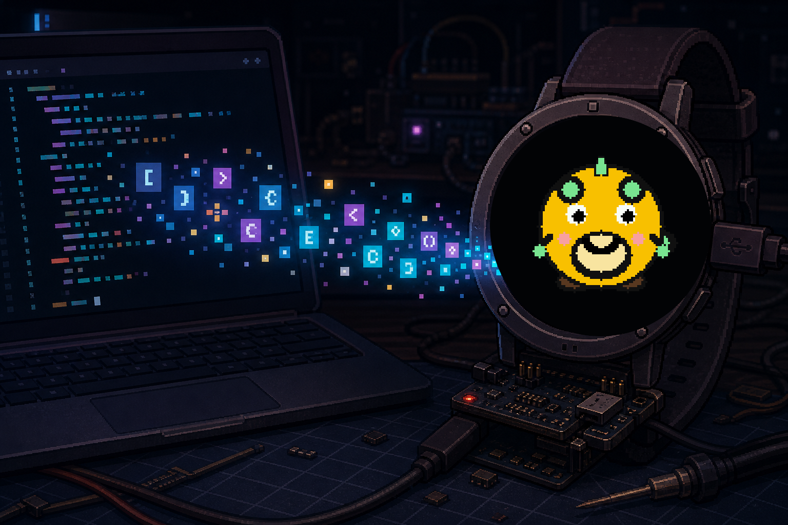
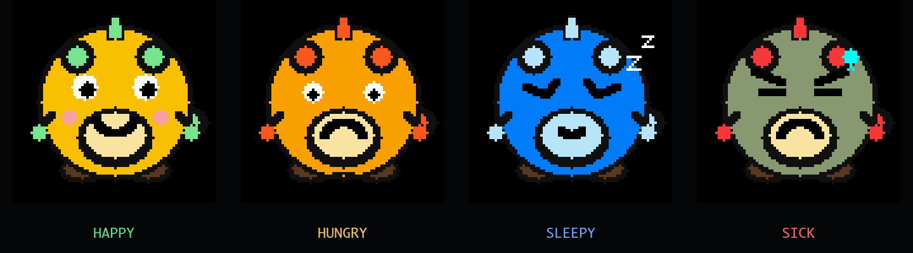

# Token Tamagotchi 🐣

**Give your AI token meter a face, a mood, and the power to make you feel
slightly guilty.**



TokenGochi turns Claude Code and Codex CLI usage into a virtual pet living on a
small ESP32 device. Your coding sessions feed it. As your token usage changes,
the creature gets hungry, happy, sleepy, or sick—and quietly judges you from
your desk or wrist.

Most token tracking lives in logs and account dashboards: useful numbers, but
easy to forget until a limit suddenly matters. TokenGochi makes that invisible
activity physical, ambient, and glanceable. You can see the shape of your AI
coding habit without opening another tab.

The joke is a mildly dystopian reversal of the Tamagotchi: instead of keeping a
digital creature alive by pressing buttons, you keep it alive by asking an AI
to write code. Productive workflow or emotional blackmail from a tiny computer?
That is between you and your pet.



The project has three main pieces:

- firmware that draws and animates the pet on an **M5Stack StopWatch Dev Kit**
  or a compact **M5StickC Plus2-class** device;
- a local Node bridge that counts Claude Code and Codex CLI tokens and turns
  activity into pet state;
- an optional Cloudflare backend for HTTPS access, plus optional Groq
  transcription so you can talk to the pet.

```
         ⌚  ← the StopWatch
   🍔  ⬆ tokens  ──▶  🌕 happy / 😟 hungry / 💤 sleepy / 🤒 sick
   ⬇ text         ⬆  466x466 round AMOLED, 4 mood-sprite frames + blink
  🌉 bridge/worker⌨  B voice mode → B record/send → Whisper on Groq → text
  ~/TokenGochi    📡  HTTPS API, fallback LAN mode available
```

## Hardware

- **M5Stack StopWatch Dev Kit** (C152, ESP32-S3R8, 8 MB PSRAM, 16 MB flash)
  — has 1.75" round AMOLED, 2 buttons, MEMS mic, speaker, vibration motor.
- **M5StickC Plus2-class ESP32-PICO device** — compact 240x135 display target
  without touch/vibration. Build with PlatformIO env `m5stickc-plus2`.
- **A Mac or VPS** running Node 18+. Local mode runs `bridge/tamagotchi-bridge.mjs` on LAN; cloud mode runs a Cloudflare Worker and can either receive pushed snapshots from `bridge/token-ingest.mjs` or pull from `bridge/token-source.mjs` on a VPS.
- **A Groq API key** (free tier is fine) — only needed for `/transcribe`.

## First-run guide (5 minutes)

### 1. Start the backend

#### Option A — Local bridge (LAN fallback)

```sh
cd bridge
cp .env.example .env
# Set DEVICE_TOKEN to: openssl rand -hex 32
# Set HOST=0.0.0.0 only if the watch connects over your trusted LAN.
./install.sh                 # copies a launchd agent, starts it on :8787
launchctl list | grep tokengochi   # confirm it’s running
curl http://localhost:8787/health  # {ok, version, groq_configured}
```

The bridge refuses to start with a missing, short, or placeholder device token.
If you want transcription, also set a Groq key in `bridge/.env`:

```sh
launchctl kickstart -k gui/$(id -u)/com.tokengochi.bridge
```

#### Option B — Cloudflare backend (recommended for guest/public Wi-Fi)

```sh
cd cloudflare
npm install
npm run deploy:staging       # set D1 IDs/secrets first; see cloudflare/README.md
```

Then choose where token totals come from.

By default, the bridge reads token counts from local Claude Code and Codex CLI
transcript logs. It does not upload the transcripts or their contents.

An experimental account-usage mode can read an existing Codex access token and
query an unsupported account endpoint. It is disabled by default, never
refreshes or rewrites `~/.codex/auth.json`, and may stop working without
notice. To opt in, set both `TOKEN_USAGE_SOURCE=codex-account` and
`EXPERIMENTAL_CODEX_ACCOUNT_USAGE=1`.

In that experimental mode, TokenGochi maps weekly usage percentage to the
existing integer food contract and derives a pace signal:

- behind pace → hungry
- on pace → happy
- ahead of pace → very happy

Push snapshots from the current machine:

```sh
cd bridge
node token-ingest.mjs --once
```

Or run a VPS token source and let Cloudflare pull from it:

```sh
cd bridge
TOKEN_SOURCE_TOKEN=... node token-source.mjs
# expose :8790 through Cloudflare Tunnel or Tailscale Funnel
# set Cloudflare TOKEN_SOURCE_URL to the public HTTPS token-source URL
```

The VPS Tailscale IP can be used for SSH/operator access, but the Worker needs
a public HTTPS tunnel/Funnel URL; it cannot fetch a private `100.x` tailnet IP
directly.

### 2. Get the backend URL

```sh
cd firmware
# for local mode, use:
ipconfig getifaddr en0
# e.g. 192.168.1.42 -> PROXY_URL "http://192.168.1.42:8787"

# for cloud mode, use the Worker URL, for example:
# PROXY_URL "https://tokengochi-staging.your-account.workers.dev"
```

You’ll paste the selected URL into firmware `src/config.h` in step 3.

### 3. Flash the firmware

```sh
cd firmware
cp src/secrets.h.example src/secrets.h
# edit src/secrets.h with your ordered WiFi networks and the bridge's DEVICE_TOKEN
# edit src/config.h to set PROXY_URL to your selected backend URL
```

Use the repo PlatformIO wrapper. It runs PlatformIO through `uv` with a
supported Python version:

```sh
../tools/pio --version
```

For the StopWatch, put it into download mode (hold the side button ~2 s until
the green LED is solid), then:

```sh
../tools/pio run -t upload
../tools/pio device monitor     # optional: 115200 baud serial log
```

For the M5StickC Plus2-class target:

```sh
../tools/pio run -e m5stickc-plus2 -t upload --upload-port /dev/cu.usbserial-...
../tools/pio device monitor --port /dev/cu.usbserial-... --baud 115200
```

### 4. Use the device

| action                                  | how                                            |
|-----------------------------------------|------------------------------------------------|
| See the pet’s mood on the disc          | just look at it (polls every 5 min)            |
| Check stats (mood / today / total / RSSI)| hold KEYB or tap the outer home ring           |
| Return home from stats                  | tap the stats screen or short-press KEYA       |
| Reset the pet (new birth, clear chat)   | stats → KEYB → KEYA, or tap yes in confirm     |
| Enter voice input mode                  | short-press KEYB                               |
| Record and send voice                   | KEYB/tap mic; Auto sends after a voice pause   |
| Cancel voice recording                  | press KEYA while recording                     |
| Open device settings                    | hold KEYA + KEYB from pet, voice, or stats     |
| Change voice mode                       | settings → Voice → tap Auto/10/20/30 s         |
| Adjust brightness / volume / feedback   | settings → Bright / Volume / Feed              |
| Check battery / warnings                | settings → Batt                                |
| Page through the transcript              | short-press KEYA or tap the screen while reading|
| Dismiss the transcript                  | short-press KEYB                                |

For a visual button/mode reference, open `docs/device-interactions.html`.

Power saver defaults lower both targets to 35% brightness, 40% volume, Wi-Fi
modem sleep, reduced CPU clock, passive sleep CPU downclock, 5 minute active
pet polling, 10 minute passive asleep polling, direct reconnect to the last
known-good SSID before scanning, 15 s auto-dim to 1%, display sleep after 30 s
of safe idle time, reduced Wi-Fi TX power while connected, MCU light sleep
with 5 s passive wake intervals, and 5 minute asleep Wi-Fi reconnect checks.
When the device is passively asleep, the Wi-Fi radio powers down between polls
or user interactions. Older saved device settings are migrated down to that
profile on first boot after the settings-version bump. The StopWatch target
skips MCU light sleep while a USB serial host is attached so diagnostics and
screen capture stay reliable, but keeps light sleep enabled for standalone or
power-only use.

### 5. Develop / iterate

- **Want a different pet?** `node tools/generate-sprites.mjs` regenerates
  `firmware/src/sprites.h` from the procedural artist in that file. The
  `tools/dump-sprite.mjs` script writes PNG previews of every frame to
  `/tmp/pet-sprites/` so you can see them on the Mac.
- **Want to test the bridge path without the device?**
  `node tools/synth-pet-state.mjs --port 8800 --cycle 3000` runs a canned
  bridge. `node tools/record-test-clip.mjs --url http://localhost:8800 --say "hi"`
  posts a TTS clip to it and prints the (mock) transcript.
- **Want a device-screen capture?**
  `node tools/capture-device-screen.mjs` captures the current AMOLED frame over
  USB serial and writes a PNG under `screenshots/`. Use the default round mask
  for the StopWatch, or `--mask none` for rectangular compact targets. StopWatch
  display geometry is documented in `docs/display-geometry.json`.

## API reference

| method | path           | auth | body              | returns                                       |
|--------|----------------|------|-------------------|-----------------------------------------------|
| GET    | `/health`      | no   | —                 | `{ok, version, groq_configured, whisper_model}` |
| GET    | `/tokens_today`| yes  | —                 | `{tokens_today, breakdown: {claude, codex}, ts}` |
| GET    | `/pet/state`   | yes  | —                 | `{mood, age_s, food_today, last_msg, last_msg_ts, total_tokens_ever, audio_runs_today, breakdown, ts}` |
| POST   | `/transcribe`  | yes  | `audio/wav` bytes | `{text, duration_s, lang, ms_groq}`           |
| POST   | `/pet/reset`   | yes  | —                 | same shape as `/pet/state` after the reset     |
| POST   | `/ingest/tokens` | ingest | token snapshot | stores pushed token totals in Cloudflare       |
| POST   | `/ingest/pull` | ingest | —                 | Cloudflare fetches the configured VPS token source |

## Architecture (one page)

```
+----------------------+      HTTPS      +----------------------+     D1      +-------------+
|  M5Stack device      | ------------->  |  Cloudflare Worker   | ---------> |  Groq API   |
|  HTTPS PROXY_URL     |                |  /pet, /transcribe   |            |  Whisper    |
+----------------------+                +----------------------+            +-------------+
       |      ^
       |      | optional LAN fallback
       |      v
+----------------------+
| bridge (LAN) +        |
| token ingest/source   |
+----------------------+
```

- **Firmware** (`firmware/`) — PlatformIO + Arduino + M5Unified. State
  machine: `IDLE / VOICE_IDLE / RECORDING / TRANSCRIBING / SHOWING / HISTORY_LIST / HISTORY_READING / STATS / CONFIRM / SETTINGS / SETTINGS_SAVED / ERROR`.
  4-sprite mood faces in `src/sprites.h` (~200 KB RGB565 in flash, PROGMEM).
- **Bridge/token source** (`bridge/`) — Self-contained `tamagotchi-bridge.mjs`
  in LAN mode, plus `token-ingest.mjs` for push publishing and
  `token-source.mjs` for VPS pull mode.
- **Cloudflare backend** (`cloudflare/`) — HTTPS API running at public URL and
  persists state in Cloudflare D1. Watch requests now avoid LAN restrictions.
- **Tools** (`tools/`) — Dev utilities: canned bridge, Mac-mic → bridge, sprite
  generator, PPM previewer, and device-screen capture.

## Testing

```sh
node bridge/_test_pure.mjs          # 11 pure-logic tests
node bridge/_test_token_source.mjs  # token-source auth and snapshot contract
node bridge/_test_transcribe.mjs    # 6 e2e tests with a mock Groq server
cd cloudflare && npm run build      # Worker dry build
cd ../firmware && ../tools/pio test -e native
```

All must exit 0. The e2e test spawns the real bridge and a mock Groq on random
ports, exercises every endpoint, and rolls back `state.json` at the end so it
leaves no side effects.

## Security and privacy

- Secrets belong only in the gitignored `bridge/.env`,
  `firmware/src/secrets.h`, Cloudflare secrets, or your service manager.
- The HTTP bridge and VPS token source bind to loopback by default. Expose them
  only through a trusted LAN or authenticated tunnel.
- Local and Cloudflare logs contain request metadata, sizes, timings, and
  status codes, but never transcript text, bearer tokens, or upstream bodies.
- Voice audio is sent to the configured Groq endpoint for transcription.
- Successful transcript text is stored in the device history and pet state;
  Cloudflare mode also persists it in your D1 database.
- See [`SECURITY.md`](SECURITY.md) for reporting and credential-rotation steps.

## Troubleshooting

| symptom                                          | fix                                                                                  |
|--------------------------------------------------|--------------------------------------------------------------------------------------|
| `PlatformIO requires Python 3.10–3.13`           | Use `./tools/pio` from the repo root; it runs PlatformIO through `uv` with Python 3.12 |
| `/transcribe → 503`                              | Add `GROQ_API_KEY` to `bridge/.env`; the bridge doesn’t crash, it just refuses       |
| Watch stuck on `wifi failed`                     | No saved SSID is visible, wrong password in `secrets.h`, or a non-2.4 GHz network     |
| `bridge down` icon on the watch                 | `ping <PROXY_URL host>` from the watch’s WiFi; check `bridge/bridge.log`             |
| Pet stuck on the same mood for hours            | `codex` / `claude` rollouts are at the wrong path; check the paths in the bridge     |
| Sprites look wrong on the device                 | Regenerate with `node tools/generate-sprites.mjs`, re-flash, eyeball `/tmp/pet-sprites/` |
| Want to nuke everything and start over          | `bridge/uninstall.sh && rm bridge/state.json`                                        |

## Project layout

```
TokenGochi/
├── PLAN.md                              design + decisions
├── README.md                            you are here
├── docs/
│   ├── display-capture.md               screenshot geometry + mask notes
│   └── display-geometry.json            round AMOLED usable-area data
├── bridge/
│   ├── tamagotchi-bridge.mjs           the server
│   ├── com.tokengochi.bridge.plist     launchd template
│   ├── install.sh / uninstall.sh
│   ├── _test_pure.mjs                   logic tests
│   ├── _test_transcribe.mjs             e2e tests
│   ├── state.json                       pet persistent state (gitignored)
│   ├── .env.example                     config template
│   └── README.md
├── firmware/
│   ├── platformio.ini
│   ├── README.md
│   └── src/
│       ├── main.cpp                     setup + main loop, firmware FSM
│       ├── config.h                     PROXY_URL + timeouts
│       ├── secrets.h.example           SSID + DEVICE_TOKEN
│       ├── audio.h / .cpp               M5.Mic record + WAV mux + M5.Speaker
│       ├── net.h / .cpp                 HTTPClient wrappers
│       ├── pet_state.h                  PetState struct
│       ├── transcript_log.h / .cpp      device-only transcript history
│       ├── pet_sprite.h / .cpp          renderer
│       ├── ui.h / .cpp                  round-disc helpers
│       └── sprites.h                    16 RGB565 frames (auto-generated)
└── tools/
    ├── README.md
    ├── synth-pet-state.mjs              canned bridge
    ├── record-test-clip.mjs             Mac-mic → bridge
    ├── capture-device-screen.mjs        USB serial screen capture
    ├── generate-sprites.mjs            sprite generator
    └── dump-sprite.mjs                  PPM previewer
```

## License

[MIT](LICENSE).
