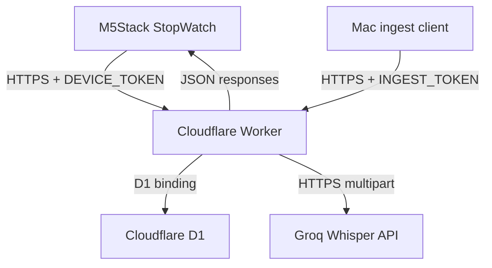
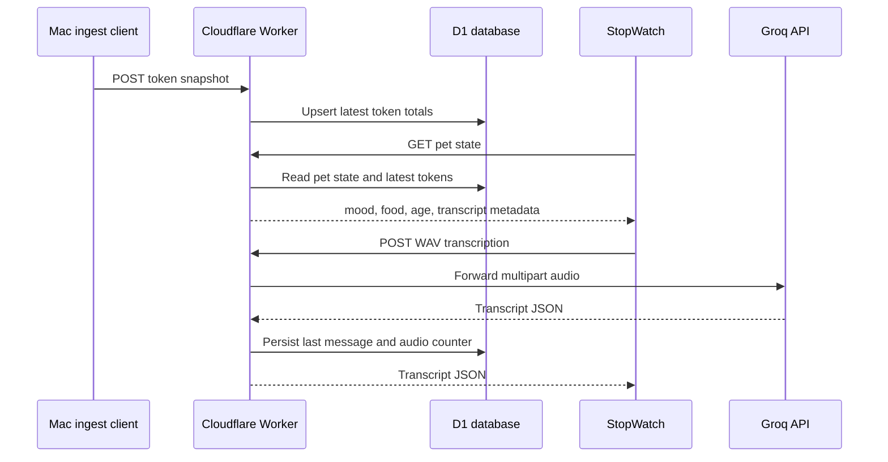

# feat: Move TokenGochi backend to Cloudflare

## Summary

Move the watch-facing TokenGochi API from a Mac LAN bridge to a Cloudflare Worker so the M5Stack StopWatch can operate on guest Wi-Fi networks that block device-to-device traffic. The Mac remains an outbound-only publisher of local Codex/Claude token totals, while the watch always talks to a public HTTPS Cloudflare endpoint.

---

## Problem Frame

The current firmware can join `A Portuguesa - Clientes` and receive an IP address, but the network blocks peer-to-peer access from the watch to the Mac bridge. The existing bridge also combines two responsibilities: serving watch API requests and reading local files from `~/.codex` / `~/.claude`. Cloudflare can host the watch API, but the local token-reading responsibility must stay on the Mac and push data outward.

---

## Requirements

- R1. The watch must use a stable public Cloudflare HTTPS URL instead of a Mac LAN IP.
- R2. The Cloudflare API must preserve the existing watch-facing contracts for health, token totals, pet state, reset, and transcription.
- R3. The Mac must publish token totals outbound to Cloudflare without accepting inbound LAN traffic.
- R4. Authentication must separate watch access, Mac ingestion, and Groq access with distinct secrets.
- R5. Pet state, token totals, transcript metadata, and daily counters must survive Worker restarts and deploys.
- R6. Local, staging, and production Cloudflare resources must stay separate in secrets, data, and deployment targets.
- R7. Firmware must support HTTPS requests to the Cloudflare URL.
- R8. Tests must cover Worker behavior, Mac ingestion, and firmware URL/TLS behavior before reflashing production firmware.

---

## High-Level Technical Design





---

## Key Technical Decisions

- KTD1. Use Cloudflare Workers, not a tunnel, for the watch-facing API: Workers remove the Mac from the inbound path and match the watch's simple HTTP API shape. Wrangler is the deployment source of truth; current local inspection found `wrangler` is not installed yet.
- KTD2. Use D1 as the first canonical store: The backend needs small structured state with updates from both watch and Mac. D1 gives a Worker binding and migrations, while KV is better suited to read-heavy key-value data and has weaker fit for coordinated state updates. Durable Objects stay deferred unless implementation reveals reset/transcribe races that require serialized mutation.
- KTD3. Keep the Mac as an outbound ingest client: Cloudflare cannot read private local Codex/Claude JSONL files from the Mac, so the existing scanners should move into a local publisher that posts snapshots.
- KTD4. Preserve the firmware API contract: The Worker should return the same JSON fields the firmware already parses so firmware changes stay limited to URL/TLS transport unless a contract gap is found.
- KTD5. Keep Cloudflare Access out of the watch path: The watch cannot complete browser authentication. Bearer tokens remain the correct device-level auth boundary for this hardware.
- KTD6. Treat HTTPS support as a firmware feature, not a deployment detail: `HTTPClient` calls currently use plain `http.begin(url)`. The firmware needs an HTTPS-capable client path before `PROXY_URL` can point at a Cloudflare URL.
- KTD7. Keep staging and production Cloudflare resources separate from the start: D1 databases and Worker secrets should be environment-scoped before any production URL is flashed, because the watch has no runtime environment switch beyond compiled firmware config.

---

## Scope Boundaries

### In Scope

- Cloudflare Worker project scaffold, Wrangler configuration, D1 schema, secrets declaration, and deployable API.
- Mac token-ingest client that reuses the existing Codex/Claude local log parsing behavior.
- Firmware network wrapper changes needed for HTTPS Cloudflare requests.
- Tests and docs for the new cloud-backed workflow.

### Deferred to Follow-Up Work

- Durable Objects for serialized state if D1-only mutation becomes insufficient.
- Custom domain setup if a `workers.dev` URL is acceptable for the first deploy.
- Cloudflare Access or dashboard UI for humans.
- Replacing Groq with another transcription provider.

### Out of Scope

- Making Cloudflare read local Mac files directly.
- Keeping the watch dependent on LAN peer-to-peer reachability.
- Committing real Wi-Fi passwords, bearer tokens, or Groq keys.

---

## Output Structure

```text
cloudflare/
├── package.json
├── wrangler.jsonc
├── migrations/
│   └── 0001_initial.sql
├── src/
│   ├── index.ts
│   ├── auth.ts
│   ├── groq.ts
│   ├── pet.ts
│   └── storage.ts
└── test/
    ├── api.test.ts
    ├── e2e.test.ts
    └── storage.test.ts
```

The exact module split can adjust during implementation, but the Worker code should remain isolated from the local bridge scripts so the old local path remains available as a fallback.

---

## Implementation Units

### U1. Cloudflare Worker Scaffold and Storage

- **Goal:** Add a Cloudflare Worker project with Wrangler configuration, D1 binding, and migrations for TokenGochi state.
- **Requirements:** R1, R4, R5, R6
- **Dependencies:** None
- **Files:** `cloudflare/package.json`, `cloudflare/wrangler.jsonc`, `cloudflare/src/index.ts`, `cloudflare/src/storage.ts`, `cloudflare/migrations/0001_initial.sql`, `cloudflare/test/storage.test.ts`
- **Approach:** Keep Cloudflare code isolated under `cloudflare/` so the existing zero-dependency local bridge remains usable while the cloud backend matures. Define tables for the latest token snapshot, pet state, transcription metadata, and ingestion audit records. Declare required secret names in Wrangler configuration so deploys fail early when secrets are missing.
- **Patterns to follow:** Existing response shapes in `bridge/tamagotchi-bridge.mjs`; existing bridge state fields in `bridge/tamagotchi-bridge.mjs`.
- **Test scenarios:**
  - Creating an empty database returns default pet state with zero food and a new birth timestamp.
  - Updating token totals records breakdown values for Codex and Claude without resetting pet birth state.
  - Resetting pet state clears `last_msg` and today's audio counter while preserving token totals.
  - Missing required secrets causes local Worker setup validation to fail before deployment.
- **Verification:** The Worker project can run locally with a bound test D1 database, and storage tests prove default, update, and reset semantics.

### U2. Worker API Contract

- **Goal:** Implement the watch-facing HTTP API in Cloudflare with the same contracts the firmware already expects.
- **Requirements:** R1, R2, R4, R5
- **Dependencies:** U1
- **Files:** `cloudflare/src/index.ts`, `cloudflare/src/auth.ts`, `cloudflare/src/pet.ts`, `cloudflare/src/groq.ts`, `cloudflare/test/api.test.ts`
- **Approach:** Port the bridge's `/health`, `/tokens_today`, `/pet/state`, `/pet/reset`, and `/transcribe` behavior into Fetch handlers. Keep auth handling centralized and return existing JSON keys so `firmware/src/net.cpp` does not need response-shape changes. Use Worker `fetch` for the Groq call and preserve the 1 MB WAV cap, which is far below Cloudflare's documented request body limits for normal account plans.
- **Patterns to follow:** Auth header behavior and HTTP status conventions in `bridge/tamagotchi-bridge.mjs`; mock Groq coverage in `bridge/_test_transcribe.mjs`.
- **Test scenarios:**
  - `GET /health` succeeds without auth and reports version plus Groq configuration state.
  - Authenticated `GET /pet/state` returns mood, food, age, last message, totals, breakdown, and timestamp.
  - Missing or wrong `DEVICE_TOKEN` returns unauthorized for watch endpoints.
  - `POST /pet/reset` returns a fresh pet state and persists the reset.
  - `POST /transcribe` rejects non-WAV bodies, rejects oversized bodies, maps Groq failures to bridge-style errors, and persists successful transcripts.
- **Verification:** Worker API tests pass against local Worker runtime and prove response compatibility with the existing firmware parser.

### U3. Mac Token Ingest Client

- **Goal:** Add a local Mac process that reads Codex/Claude token logs and publishes token snapshots to the Cloudflare Worker.
- **Requirements:** R3, R4, R5, R6
- **Dependencies:** U2
- **Files:** `bridge/token-ingest.mjs`, `bridge/com.tokengochi.ingest.plist`, `bridge/install-ingest.sh`, `bridge/uninstall-ingest.sh`, `bridge/_test_ingest.mjs`, `bridge/README.md`
- **Approach:** Extract or reuse the existing token-scanning logic from `bridge/tamagotchi-bridge.mjs` and post `{tokens_today, breakdown, ts}` to a new ingestion endpoint. Keep the client outbound-only and launchd-managed, mirroring the existing bridge install pattern. Use a separate `INGEST_TOKEN` so Mac publisher credentials are not interchangeable with device credentials.
- **Patterns to follow:** Existing `claudeRoots`, `codexHomes`, `computeClaude`, and `computeCodex` logic in `bridge/tamagotchi-bridge.mjs`; launchd structure in `bridge/install.sh` and `bridge/com.tokengochi.bridge.plist`.
- **Test scenarios:**
  - Synthetic Codex and Claude JSONL fixtures produce the expected token total and breakdown.
  - Repeated publishes with unchanged totals do not inflate `total_tokens_ever` in the Worker.
  - Wrong `INGEST_TOKEN` is rejected without changing cloud state.
  - Network failure logs a retryable error and leaves local token scanning intact.
- **Verification:** Ingest tests pass with a mock Worker, and a local launchd dry run can publish to a staging Worker.

### U4. Firmware HTTPS Transport

- **Goal:** Update firmware networking so the watch can call a Cloudflare HTTPS URL reliably.
- **Requirements:** R1, R2, R7, R8
- **Dependencies:** U2
- **Files:** `firmware/src/net.cpp`, `firmware/src/net.h`, `firmware/src/config.h`, `firmware/src/secrets.h.example`, `firmware/README.md`
- **Approach:** Add an HTTPS-capable `HTTPClient` setup path using `WiFiClientSecure` when `PROXY_URL` starts with `https://`. Keep plain HTTP support for local synthetic bridge tests. The implementation can start with insecure TLS only as a debug path, but the plan's production posture is to validate Cloudflare certificates or pin an appropriate trust anchor.
- **Execution note:** Characterize the current HTTP behavior before changing transport so bridge-down and HTTP-status diagnostics remain readable on serial.
- **Patterns to follow:** Existing network wrappers in `firmware/src/net.cpp`; current diagnostic logging in `firmware/src/main.cpp`.
- **Test scenarios:**
  - HTTP `PROXY_URL` still uses the existing local transport path.
  - HTTPS `PROXY_URL` initializes a secure client and preserves headers for auth and content type.
  - TLS or DNS connection failure reports a useful `lastStatus()` value or serial diagnostic.
  - A staged firmware build with the Cloudflare URL can fetch `/health` and `/pet/state`.
- **Verification:** Firmware builds successfully and device serial logs show Wi-Fi connected plus Cloudflare bridge online on a guest Wi-Fi network.

### U5. Staging, Secrets, and Deployment Flow

- **Goal:** Define a safe Wrangler-backed deployment workflow with separate staging and production resources.
- **Requirements:** R4, R6, R8
- **Dependencies:** U1, U2, U3, U4
- **Files:** `cloudflare/wrangler.jsonc`, `cloudflare/README.md`, `README.md`, `.gitignore`
- **Approach:** Use Wrangler environments for staging and production, separate D1 databases, and separate required secrets for each environment. Keep all secret values out of Git. Document the exact values that operators must provision without embedding those values in tracked files.
- **Patterns to follow:** Existing `.env` guidance in `bridge/README.md`; repo-level `.gitignore` secret exclusions.
- **Test scenarios:**
  - Staging Worker uses staging D1 and staging secret names.
  - Production Worker cannot deploy if required secrets are missing.
  - Firmware staging URL can be flashed without touching production config.
  - README instructions keep local, staging, and production data separated.
- **Verification:** Staging deployment is smoke-tested before any production URL is placed into firmware defaults.

### U6. End-to-End Cloud Verification

- **Goal:** Prove the full cloud-backed TokenGochi path before considering the migration complete.
- **Requirements:** R1, R2, R3, R5, R7, R8
- **Dependencies:** U2, U3, U4, U5
- **Files:** `tools/cloud-smoke.mjs`, `cloudflare/test/e2e.test.ts`, `STATUS.md`, `README.md`
- **Approach:** Add a smoke tool that exercises the cloud URL with device and ingest tokens, then use it to verify health, ingestion, pet state, reset, and transcription behavior. Capture the verified staging URL and known limitations in `STATUS.md` without recording secrets.
- **Patterns to follow:** Existing bridge smoke style in `bridge/_test_transcribe.mjs`; current status reporting in `STATUS.md`.
- **Test scenarios:**
  - Cloud smoke health succeeds over the public URL.
  - Ingesting a known token snapshot changes `/pet/state` food and breakdown.
  - Reset updates cloud state and returns a young pet.
  - A mock or real transcription request returns text and updates `last_msg`.
  - The flashed watch works on a guest/client-isolated Wi-Fi network because it no longer calls the Mac.
- **Verification:** Serial logs from the watch show Wi-Fi connected and Cloudflare bridge online, and Worker logs show corresponding requests.

---

## System-Wide Impact

- **Firmware interface:** `PROXY_URL` becomes a public HTTPS endpoint instead of a LAN address, so firmware builds need an intentional staging/production target.
- **Auth boundary:** Device, ingest, and Groq credentials become separate trust boundaries; leaking one token must not grant all capabilities.
- **Data lifecycle:** Pet state moves from local `bridge/state.json` to Cloudflare D1, while token source-of-truth remains the Mac's local log files.
- **Operational model:** Launchd shifts from serving inbound bridge traffic to pushing outbound token snapshots; Worker logs become the primary request trace for watch activity.
- **Failure behavior:** If the Mac ingest client is offline, the watch should still render the last known cloud state and continue transcription/reset behavior where possible.

---

## Risks & Dependencies

- **Cloudflare account and Wrangler setup:** `wrangler` is not currently installed in this checkout environment, so implementation must add or document the local toolchain before deploy work.
- **Storage semantics:** D1 should be enough for one watch and one Mac publisher. If concurrent reset/transcribe/ingest updates conflict during testing, promote the state mutation path to Durable Objects.
- **TLS on ESP32-S3:** Secure certificate validation may require memory and certificate-chain testing on the device. Temporary insecure TLS must not be treated as production-complete.
- **Groq latency:** `/transcribe` already depends on Groq response time. Worker limits allow waiting on network subrequests, but implementation should keep body sizes bounded and return clear errors.
- **Cloudflare Free plan limits:** The current audio body cap is far below documented request body limits, but daily request and CPU limits still matter if polling intervals are shortened.

---

## Documentation and Operational Notes

- Update first-run docs so the default path is Cloudflare URL plus Mac ingest, not Mac LAN IP plus bridge.
- Keep the old local bridge documented as a development fallback until the Cloudflare path is stable.
- Document required Cloudflare resources: Worker, D1 staging database, D1 production database, `DEVICE_TOKEN`, `INGEST_TOKEN`, and `GROQ_API_KEY`.
- Record successful staging smoke evidence in `STATUS.md`, including the tested URL, firmware build date, and whether transcription was tested with a real Groq key.

---

## Sources and Research

- Cloudflare Workers use Wrangler as the CLI and configuration/deploy surface: [Wrangler docs](https://developers.cloudflare.com/workers/wrangler/).
- Worker routes should be implemented with the Fetch handler model and outbound `fetch` for Groq: [Workers Fetch API](https://developers.cloudflare.com/workers/runtime-apis/fetch/).
- D1 is configured through Worker bindings and migrations in Wrangler configuration: [D1 getting started](https://developers.cloudflare.com/d1/get-started/) and [D1 migrations](https://developers.cloudflare.com/d1/reference/migrations/).
- Worker secrets can be declared as required and provisioned through Wrangler: [Workers secrets](https://developers.cloudflare.com/workers/configuration/secrets/).
- KV is optimized for global key-value reads, which makes it a useful alternative but not the first choice for this structured pet-state plan: [Workers KV bindings](https://developers.cloudflare.com/kv/concepts/kv-bindings/).
- Workers request body limits are well above the current 1 MB WAV cap on normal Cloudflare account plans: [Workers limits](https://developers.cloudflare.com/workers/platform/limits/).
