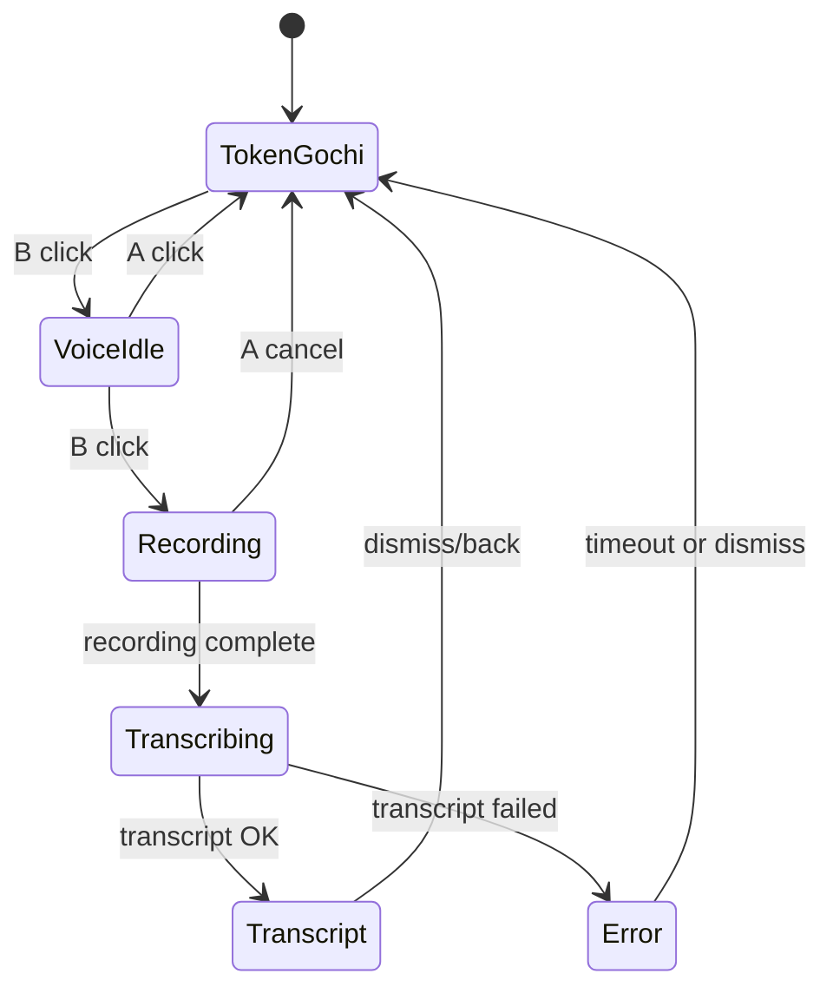

# feat: Separate TokenGochi and voice input modes

## Summary

Separate the watch UX into a default TokenGochi pet mode and an explicit voice input mode. `B` enters voice mode without recording, a second `B` starts recording, and `A` returns to TokenGochi so transcription cannot be triggered by the first mode-switch press.

---

## Problem Frame

The current firmware couples voice recording to the pet screen: from idle, `A` starts recording immediately, and the in-progress worktree also allows an `A` hold from transcript view to start another recording. That makes voice transcription feel like a hidden action layered on top of TokenGochi rather than a separate mode. The requested UX needs a visible mode boundary so the pet experience and the voice recorder have different entry points and different acceptance criteria.

---

## Requirements

- R1. The watch must boot into TokenGochi pet mode.
- R2. A first `B` press from TokenGochi mode must enter voice input mode without starting mic capture or sending a transcription request.
- R3. A second `B` press from voice input mode must start recording.
- R4. `A` from voice input mode must return to TokenGochi mode.
- R5. While recording, the firmware must have a defined exit path that does not leave the mic active or the UI stuck.
- R6. TokenGochi polling, mood rendering, and pet state refresh must stay independent from transcription.
- R7. Existing stats/reset access must not disappear unless the implementation explicitly records a replacement UX decision.
- R8. Firmware docs must describe the new button model and remove stale hold-A-to-talk instructions.
- R9. Verification must distinguish firmware build/log evidence from real device UX evidence.

---

## High-Level Technical Design

The diagram names product states, not exact enum names. The implementation can map them onto the existing `Mode` enum or split pet/voice view state if that keeps the button handling clearer.

---

## Key Technical Decisions

- KTD1. Treat voice as a mode, not as a button shortcut: The first `B` press should only change UI state. This directly prevents accidental capture and gives the user a visible arming step before audio starts.
- KTD2. Keep `beginRecording` behind the voice-mode branch: Recording should be callable only from states where the user has already entered voice input. This is the load-bearing separation between TokenGochi and transcription.
- KTD3. Define `A` during recording as cancel/back unless implementation discovers a stronger hardware convention: The user asked for `A` to return to TokenGochi, and cancellation is the safest interpretation while the mic is active because it prevents unwanted uploads.
- KTD4. Preserve stats/reset as a secondary TokenGochi action: `B` is being reassigned to voice mode, so stats/reset needs a non-conflicting gesture, such as a long press, or a documented follow-up if the button library makes that unreliable.
- KTD5. Verify by observing state transitions, not just by building: The success condition is that the first `B` press does not start recording or call `/transcribe`, which requires serial/device evidence in addition to `pio run`.

---

## Scope Boundaries

### In Scope

- Firmware state-machine changes for TokenGochi, voice idle, recording, transcribing, transcript, error, stats, and reset flows.
- Minimal UI affordance for voice idle mode so users can see that recording has not started yet.
- Firmware docs for the new button model.
- Verification guidance for build, serial logs, and device screen capture.

### Deferred to Follow-Up Work

- Any backend change to transcription semantics, Groq behavior, stored transcript data, or `/pet/state`.
- A richer voice conversation UI beyond entering voice mode, recording, sending, and showing transcript/error.
- Production deployment or Cloudflare Worker changes.

### Out of Scope

- Committing or inspecting secret files.
- Reworking audio capture internals unless needed to stop or cancel recording safely.
- Changing the TokenGochi mood/token calculation.

---

## Acceptance Examples

- AE1. Starting from TokenGochi mode, press `B` once. The screen changes to voice input mode, serial logs show a voice-mode transition, `audio::micActive()` remains false, and no `/transcribe` request is made.
- AE2. Starting from voice input mode, press `B` again. The firmware arms the mic, starts recording, and shows the recording UI.
- AE3. Starting from voice input mode before recording starts, press `A`. The watch returns to TokenGochi mode and resumes normal pet rendering/polling.
- AE4. Starting from recording mode, press `A`. The firmware stops or cancels recording, leaves the mic inactive, does not upload an unintended clip, and returns to TokenGochi mode.
- AE5. After a successful recording, transcript display remains dismissible and the pet mode is reachable without triggering another recording.

---

## Implementation Units

### U1. Introduce Explicit Voice Idle Mode

**Goal:** Add a visible voice input state between TokenGochi and recording.

**Requirements:** R1, R2, R4, R6

**Dependencies:** None

**Files:** `firmware/src/main.cpp`, `firmware/src/ui.h`, `firmware/src/ui.cpp`

**Approach:** Extend the current mode model so TokenGochi idle and voice idle are distinct states. From TokenGochi mode, `B` should transition to voice idle and draw a simple voice-ready screen. From voice idle, `A` should return to TokenGochi, reset any transient voice UI state, and force a clean pet redraw or poll as appropriate.

**Execution note:** Start with characterization of the existing `A` and `B` transitions in serial logs before changing the button handling, because the worktree already has an uncommitted transcript-follow-up recording change in `firmware/src/main.cpp`.

**Patterns to follow:** Existing `Mode` enum and `switch (g_mode)` structure in `firmware/src/main.cpp`; existing focused UI helpers such as `ui::drawArming`, `ui::drawRec`, and `ui::drawStats`.

**Test scenarios:**

- Happy path: boot into TokenGochi mode, click `B`, and observe voice idle UI with no mic activity.
- Edge case: click `A` immediately after entering voice idle and verify TokenGochi redraws without a stale voice overlay.
- Edge case: let pet polling happen after returning from voice idle and verify normal mood/status rendering still updates.
- Failure prevention: click `B` once and verify no serial log path reaches `beginRecording`, `audio::startRecording`, or `net::postTranscribe`.

**Verification:** `pio run` passes, serial logs show TokenGochi-to-voice-idle and voice-idle-to-TokenGochi transitions, and device screen capture shows distinct pet and voice-ready screens when hardware is available.

### U2. Gate Recording Behind Second B Press

**Goal:** Move recording start so it only fires from voice idle mode after the second `B` press.

**Requirements:** R2, R3, R5, R6

**Dependencies:** U1

**Files:** `firmware/src/main.cpp`, `firmware/src/audio.h`, `firmware/src/audio.cpp`, `firmware/src/net.h`, `firmware/src/net.cpp`

**Approach:** Remove direct recording entry from TokenGochi idle and transcript follow-up paths unless they first enter voice mode. Keep `beginRecording` as the shared recording setup helper, but call it only from voice idle. Keep `transcribeAndShow` unchanged unless implementation reveals it assumes the old entry state.

**Patterns to follow:** Current `beginRecording` helper in `firmware/src/main.cpp`; current `audio::startRecording`, `audio::pumpRecording`, and `audio::stopRecording` lifecycle in `firmware/src/audio.cpp`; current `/transcribe` wrapper in `firmware/src/net.cpp`.

**Test scenarios:**

- Happy path: `B` from TokenGochi then `B` from voice idle starts recording and shows `REC`.
- Failure prevention: `A` from TokenGochi no longer starts recording.
- Failure prevention: `A` hold from transcript does not bypass voice idle and start recording.
- Integration: recording completion still POSTs the WAV to `/transcribe` and reaches transcript or error state.
- Edge case: repeated fast `B` clicks do not count one physical press as both voice entry and recording start.

**Verification:** Firmware build passes, serial logs prove the first `B` only enters voice idle, serial logs prove the second `B` starts recording, and a controlled recording still reaches the existing transcript/error flow.

### U3. Define Recording Cancellation and Cleanup

**Goal:** Make `A` during recording return to TokenGochi without leaking mic state or uploading an unintended clip.

**Requirements:** R4, R5, R6

**Dependencies:** U2

**Files:** `firmware/src/main.cpp`, `firmware/src/audio.h`, `firmware/src/audio.cpp`

**Approach:** Add an explicit recording cancel path. If the current audio module cannot discard a recording cleanly, add the smallest audio helper needed to stop the mic and re-enable the speaker without returning a WAV for transcription. Keep the existing auto-stop-at-10s behavior as the normal completion path.

**Patterns to follow:** Existing `audio::stopRecording` mux cleanup; existing chirp/vibration feedback boundaries in `firmware/src/main.cpp`.

**Test scenarios:**

- Happy path: while recording, press `A`; recording stops, mic becomes inactive, and the screen returns to TokenGochi.
- Failure prevention: cancellation does not call `net::postTranscribe`.
- Edge case: cancel before any PCM slot is captured and verify the UI still recovers.
- Edge case: cancel near the 10 second auto-stop boundary and verify only one terminal path runs.

**Verification:** Serial logs show the cancel path, no transcription log appears after cancel, and `audio::micActive()` or equivalent serial evidence confirms the mic is inactive.

### U4. Preserve Stats and Reset Access

**Goal:** Keep the existing stats/reset workflow reachable after `B` becomes the voice-mode entry button.

**Requirements:** R7

**Dependencies:** U1

**Files:** `firmware/src/main.cpp`, `firmware/README.md`

**Approach:** Choose a non-conflicting gesture for stats from TokenGochi mode, with long-press `B` as the first candidate because short `B` now enters voice mode and `A` is reserved for returning home from voice states. If long-press `B` cannot be separated cleanly from short `B`, choose and document an alternate stats gesture in the same implementation unit rather than dropping stats access. Preserve the existing stats-to-confirm and confirm-to-reset behavior once stats is open.

**Patterns to follow:** Current `Mode::STATS` and `Mode::CONFIRM` branches in `firmware/src/main.cpp`; existing button table in `firmware/README.md`.

**Test scenarios:**

- Happy path: from TokenGochi mode, the chosen stats gesture opens stats.
- Happy path: from stats, existing reset confirm and cancel actions still behave as documented.
- Failure prevention: short `B` from TokenGochi enters voice idle rather than stats.
- Edge case: the stats gesture does not accidentally enter voice idle first.

**Verification:** Serial logs and device screen evidence show stats/reset remains reachable, and the firmware docs match the implemented gesture.

### U5. Update Firmware Documentation and Verification Notes

**Goal:** Align user-facing firmware docs with the separated mode UX and the verification standard for this hardware change.

**Requirements:** R8, R9

**Dependencies:** U1, U2, U3, U4

**Files:** `firmware/README.md`, `STATUS.md`

**Approach:** Replace hold-A-to-talk language with the new mode model and update the button table. Record verification status precisely: build/log evidence can be `verified`; real device UX remains `not verified` until tested on the StopWatch with serial logs or screen capture.

**Patterns to follow:** Existing `firmware/README.md` button table; existing `STATUS.md` style that separates verified behavior from not-verified behavior.

**Test scenarios:**

- Documentation: every documented button action has a corresponding implemented state-machine path.
- Documentation: stale hold-A-to-talk instructions are removed.
- Documentation: verification notes distinguish firmware build, serial monitor, screen capture, and production deployment.

**Verification:** Docs review finds no stale A-to-record references, and the handoff lists exact checks run plus any hardware paths that remain `not verified`.

---

## Risks & Dependencies

- Button event semantics may make long-press and short-click interactions conflict. If `M5.BtnB.wasHold()` and `wasClicked()` cannot be cleanly separated, U4 owns choosing a different stats gesture and documenting the final button model.
- The current worktree already has an uncommitted `A hold from transcript` recording change in `firmware/src/main.cpp`; implementation should either incorporate that intent into the new mode model or remove it as part of the mode separation.
- Real UX correctness depends on hardware. A successful firmware build alone does not verify button timing, debounce behavior, screen clarity, mic cleanup, or accidental-upload prevention.

---

## Sources & Research

- `AGENTS.md` sets the firmware verification standard, secret boundaries, and requirement to preserve clear `verified` / `not verified` reporting.
- `firmware/src/main.cpp` currently owns the `Mode` enum, button state machine, `beginRecording`, and `transcribeAndShow`.
- `firmware/src/audio.cpp` owns mic/speaker muxing and the recording lifecycle.
- `firmware/src/ui.cpp` already has separate helpers for arming, recording, transcript, stats, confirm, mood, and offline views.
- `firmware/README.md` currently documents hold-A-to-talk and B-for-stats/reset, so it must change with the firmware UX.
