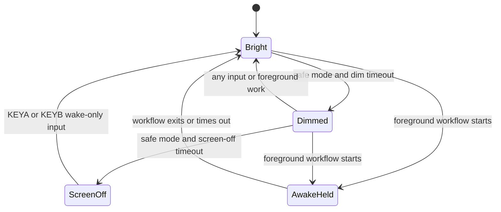
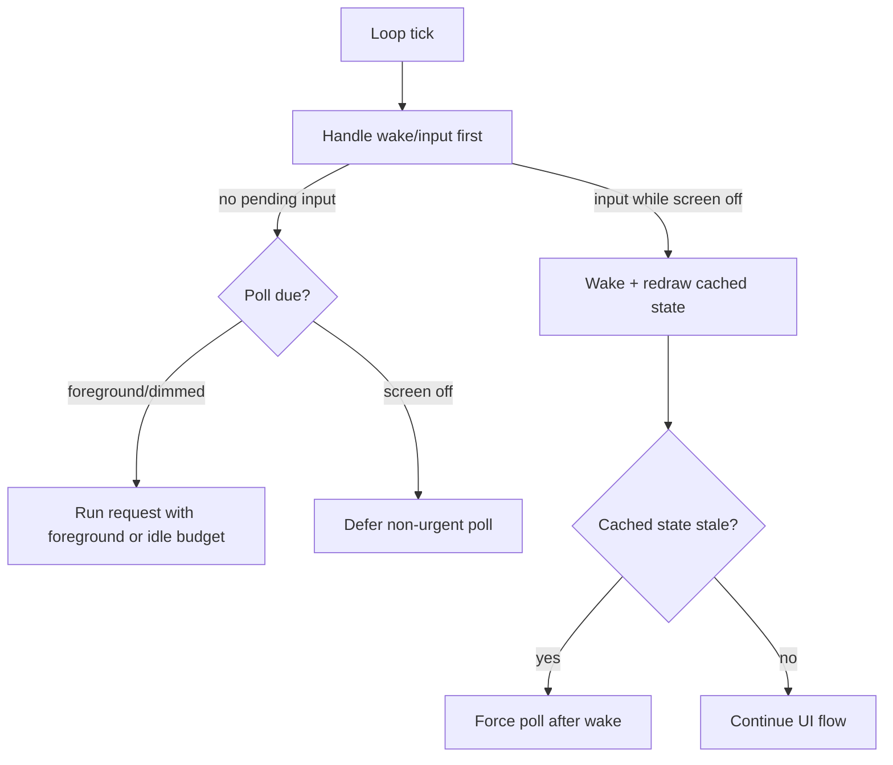

# perf: Improve TokenGochi firmware power efficiency

## Summary

Reduce StopWatch idle power draw without changing the core TokenGochi experience. The plan starts with a power-measurement gate, then applies measured firmware changes across Wi-Fi, display, polling cadence, loop cadence, and audio idle state while deferring true standby/deep sleep until wake semantics are intentionally redesigned.

---

## Problem Frame

The firmware currently behaves like a constantly active desktop client: Wi-Fi modem sleep is disabled, `/pet/state` polling runs on a fixed 30 second cadence, the pet blink can redraw at 4 fps while idle, the loop wakes every 20 ms, and the speaker path is enabled during boot. TokenGochi is mostly a glanceable wearable-style device, so idle current dominates battery life.

The existing working tree is already dirty across firmware, backend, docs, and sprite generation. Implementation should treat current firmware behavior as the baseline and avoid mixing this work with unrelated backend, sprite, or UX changes.

---

## Requirements

**Measurement and Safety**

- R1. The firmware must record a repeatable before/after idle-current measurement for each power-efficiency phase when the physical StopWatch is available.
- R2. Power changes must preserve the current TokenGochi button, touch, polling, recording, transcript, stats, and reset flows.
- R3. Verification must distinguish build evidence from live-device power and UX evidence.

**Idle Power**

- R4. The watch must use Wi-Fi power saving while preserving staging Worker reachability and transcription uploads.
- R5. The display must dim and then sleep after inactivity, require KEYA/KEYB wake from screen-off, and treat touch wake as best-effort until verified on hardware.
- R6. Idle redraws and loop wakeups must slow down when the user is not interacting with the watch.
- R7. Polling must become less frequent during stable idle periods, and screen-off polling must not block local wake responsiveness.
- R8. Wi-Fi reconnect scans must back off while disconnected instead of repeating high-power scans every 10 seconds.
- R9. Audio output hardware must not remain powered only to make rare chirps convenient.

**Documentation**

- R10. Firmware docs and status notes must explain the measured power profile, the implemented power states, and any hardware paths that remain `not verified`.

---

## High-Level Technical Design

Display state is separate from product mode. TokenGochi can be idle, voice-ready, recording, showing a transcript, in stats, or in settings while the power policy decides whether the screen may dim or sleep. Recording, transcribing, transcript/history reading, settings, errors, and reset confirmation hold the display awake because hiding those screens would obscure active work or a decision point.

---

## Key Technical Decisions

- KTD1. Start with a measurement claim gate: Power work without comparable current readings can only prove that behavior changed, not that battery life improved. M5Unified exposes `M5.Power.getBatteryCurrent()`, but the plan treats its sign, noise, and support on this board as something to verify on-device before any power-saving claim.
- KTD2. Characterize Wi-Fi modem sleep before selecting the default: Espressif documents modem sleep as a station-mode power save that keeps AP association by waking around DTIM/listen intervals. The planned default is minimum modem sleep if the current Arduino/ESP-IDF stack exposes it reliably; no-sleep remains the fallback if staging reachability or transcription upload regresses.
- KTD3. Keep automatic light sleep and deep sleep deferred: ESP-IDF power management can add dynamic frequency scaling and automatic light sleep, but it changes interrupt latency and wake behavior. That belongs after the visible firmware UX survives lower-risk power states.
- KTD4. Put pure power policy behind a small firmware module: Display dim/sleep eligibility, poll cadence, reconnect backoff, loop delay, and measurement labels are related decisions. `power_manager` should not own product `Mode`, network calls, user actions, or display hardware calls; `main.cpp` and `ui.cpp` keep those responsibilities.
- KTD5. Prefer adaptive polling over persistent HTTP reuse for the first network optimization: The current `HTTPClient` wrappers close each request, but Cloudflare keep-alive behavior over long gaps is an execution-time discovery. Poll backoff is simpler, reversible, and directly reduces radio/TLS bursts.
- KTD6. Power the speaker on demand: The installed M5Unified StopWatch speaker callback controls ES8311/audio power and the PA when the speaker is enabled or disabled. TokenGochi chirps are rare, so keeping speaker power enabled from boot is not justified.
- KTD7. Treat screen-off as input-first: Screen-off must not start non-urgent network work before checking local wake input. If cached state is stale on wake, the watch should redraw cached state first and force a poll after wake rather than blocking the wake path on `/pet/state`.
- KTD8. Use TGSHOT for framebuffer evidence, not brightness evidence: `tools/capture-device-screen.mjs` verifies what the firmware would draw after wake. Dimming and AMOLED sleep need serial transition logs, live visual/camera observation, or current measurement.

---

## Scope Boundaries

### In Scope

- Firmware measurement helpers and serial evidence for current draw.
- Wi-Fi modem sleep, reconnect backoff, and adaptive `/pet/state` polling.
- Display dim/sleep/wakeup policy for the round AMOLED.
- Loop and blink throttling while idle or screen-off.
- Audio speaker idle cleanup and chirp regression coverage.
- Firmware documentation/status updates for power behavior and verification.

### Deferred to Follow-Up Work

- Automatic light sleep through `esp_pm_configure`, dynamic frequency scaling policy, or FreeRTOS tickless-idle configuration.
- Deep sleep, power-off standby, or wake-from-GPIO product behavior.
- Persistent HTTPS connection reuse, TLS session reuse, or transport pooling if adaptive polling already meets the power target.
- Removing Wi-Fi diagnostic logging that was added for earlier network debugging unless it materially affects measured idle current.

### Out of Scope

- Cloudflare Worker changes, production deploys, migrations, or secret changes.
- Changing the TokenGochi mood model, pace logic, sprite generation, or backend token source.
- Inspecting or committing secret-bearing files.

---

## Acceptance Examples

- AE1. With the watch on a known working Wi-Fi network and no user input, capture a baseline average current, then capture comparable averages after each implemented phase.
- AE2. After Wi-Fi modem sleep is enabled, the watch still boots, reaches the staging Worker, performs multiple `/pet/state` polls, and can POST a transcription clip.
- AE3. After display idle timeout, the screen dims; after the longer timeout, the AMOLED sleeps; the first KEYA or KEYB press wakes the display and redraws the correct current product mode without also triggering the underlying product action.
- AE4. While recording, transcribing, changing settings, confirming reset, showing an error, or reading a transcript, the display does not sleep underneath the active workflow.
- AE5. When idle with the screen off, non-urgent background polling is deferred so local wake is not blocked; if cached state is stale after wake, the firmware forces a poll after redrawing.
- AE6. When Wi-Fi is unavailable, reconnect attempts back off and serial logs show the backoff interval rather than a 10 second scan loop.
- AE7. After speaker-on-demand changes, success/failure chirps still play and recording still muxes cleanly between speaker and mic.
- AE8. If `/pet/state` is slow or times out while the screen is off, pressing KEYA or KEYB still wakes within the wake-latency target or the implementation marks that path `not verified` and disables screen-off background polling.

---

## Power Policy Contracts

### Measurement Protocol and Claim Gate

Power claims require comparable measurements: same power source, same known-good Wi-Fi network, comparable RSSI, same backend target, same display state, same firmware mode, similar battery state, and a settling period before sampling. Each phase should use at least three fixed-duration windows and record average, min, max, sample count, voltage, charge/discharge sign, and observed noise. A phase may claim a power improvement only when the delta is larger than the measured noise floor and at least 5 mA or 10%, whichever is greater. If the built-in current reading is unsupported or unstable, implementation may continue as behavior work, but power impact remains `not verified` until an external meter setup is approved and recorded.

### Display Mode Policy

| Product mode | Dim allowed | Screen-off allowed | Awake rule |
|---|---:|---:|---|
| `IDLE` | yes | yes | Wake-only first key press from screen-off. |
| `VOICE_IDLE` | yes | yes | Stay in voice-ready after wake; first screen-off key press is wake-only. |
| `RECORDING` | no | no | Keep bright until cancel, stop, or auto-stop. |
| `TRANSCRIBING` | no | no | Keep bright until transcript or error. |
| `SHOWING` | no | no | Keep transcript readable until dismiss/page action. |
| `HISTORY_LIST` | no | no | Keep list readable until open, cycle, or back action. |
| `HISTORY_READING` | no | no | Keep entry readable until page/back action. |
| `STATS` | no | no | Keep bright until existing stats timeout or exit. |
| `CONFIRM` | no | no | Keep bright until confirm timeout or decision. |
| `SETTINGS` | no | no | Keep bright until existing settings timeout or exit. |
| `SETTINGS_SAVED` | no | no | Keep bright through the short saved confirmation. |
| `ERROR` | no | no | Keep bright until error timeout or dismiss. |

V1 defaults should be explicit and tunable: 30 seconds to dim, 180 seconds from last interaction to screen-off, 250 ms target for wake-to-redraw, and a short input-suppression window after screen-off wake so the wake press cannot double-trigger history, voice, paging, or navigation.

### Wake Input Contract

| Input while dimmed | Expected behavior |
|---|---|
| KEYA / KEYB short | Brighten first, then handle the normal product action. |
| KEYB hold / A+B hold | Brighten and preserve the existing hold/chord behavior. |
| Touch | Brighten and handle the normal visible touch target if the target is still valid. |

| Input while screen-off | Expected behavior |
|---|---|
| KEYA / KEYB short | Wake-only, redraw cached state, suppress product action until button release. |
| KEYB hold / A+B hold | Wake-only first; require release before a hold/chord can trigger. |
| Touch | Best-effort wake-only if touch events are still delivered; otherwise `not verified` and buttons are the required wake path. |

### Polling Budget

Foreground and recovery polling should keep the existing 30 second freshness target. Stable dimmed idle may use a longer target, initially 180 seconds. Stable means no user input since the dim threshold and at least two consecutive successful polls where mood, food/tokens, audio counters, last message timestamp, and Codex usage/pace fields are unchanged. Screen-off should defer non-urgent background polls; on wake, redraw cached state immediately and force a poll if the cached state is older than 60 seconds. A wake-triggered refresh should update the display within one foreground request budget, or the path remains `not verified`.

---

## Implementation Units

### U1. Add Power Measurement Baseline

**Goal:** Make power-efficiency work measurable before changing behavior.

**Requirements:** R1, R3, R10

**Dependencies:** None

**Files:** `firmware/src/main.cpp`, `STATUS.md`

**Approach:** Add a serial-only measurement path that samples battery current over the protocol above and prints average, minimum, maximum, sample count, battery voltage, display power state, Wi-Fi state, and product mode. Keep the measurement path developer-facing rather than adding UI. Validate the measurement source first; if readings are constant zero, unsupported, charging-only, or too noisy, record the blocker before implementing later power phases.

**Patterns to follow:** Existing `handleSerialCommands()` and `TGSHOT` serial command shape in `firmware/src/main.cpp`; M5Unified `M5.Power.getBatteryCurrent()` / `getBatteryVoltage()` APIs; current `STATUS.md` verified/not-verified style.

**Test scenarios:**

- Happy path: send the measurement command while idle and verify serial output includes sample count, current stats, voltage, mode, Wi-Fi status, and display power state.
- Edge case: if `getBatteryCurrent()` returns a board-unsupported sentinel or constant zero while USB-powered, report the measurement as `not verified` rather than an improvement.
- Integration: run measurement before and after a no-op firmware rebuild and confirm the command itself does not redraw or change product mode.
- Claim gate: a later unit cannot claim reduced power unless U1 has a valid baseline and a comparable after measurement.

**Verification:** Firmware builds, the serial command produces a parsable measurement on the connected StopWatch, and `STATUS.md` records the baseline, measurement protocol, noise floor, and whether power claims are currently `verified` or `not verified`.

### U2. Enable Wi-Fi Modem Sleep and Reconnect Backoff

**Goal:** Reduce radio idle current and avoid repeated high-power scans while disconnected.

**Requirements:** R2, R4, R8

**Dependencies:** U1

**Files:** `firmware/src/main.cpp`, `firmware/src/power_manager.h`, `firmware/src/power_manager.cpp`, `firmware/test/test_power_manager.cpp`, `firmware/platformio.ini`, `firmware/src/config.h`, `STATUS.md`

**Approach:** Add the first pure `power_manager` policy for reconnect backoff and firmware test coverage for capped/reset behavior. Characterize candidate ESP32-S3 station power-save settings on the known-good network, then replace the current forced no-sleep Wi-Fi setting with the selected modem-sleep default. Reset reconnect backoff after a successful connection.

**Execution note:** Characterize boot, `/health`, and repeated `/pet/state` polling before and after this unit because Wi-Fi reliability regressions can look like backend failures.

**Patterns to follow:** Existing `connectWifi()`, Wi-Fi event logging, visible-network scan, and `g_lastRecon` watchdog in `firmware/src/main.cpp`; `POLL_INTERVAL_MS`-style tunables in `firmware/src/config.h`.

**Test scenarios:**

- Happy path: on a known working Wi-Fi network, boot reaches `WL_CONNECTED`, `/health` returns OK, and at least three `/pet/state` polls succeed with modem sleep enabled.
- Integration: record and transcribe a short clip after modem sleep is enabled to prove upload bursts still work.
- Failure path: with Wi-Fi unavailable, serial logs show reconnect backoff increasing and capped rather than scanning every 10 seconds.
- Edge case: after a later successful connection, the reconnect interval returns to the short starting interval.
- Unit policy: repeated reconnect failures produce the expected capped backoff sequence, and success resets the sequence.
- Characterization: selected Wi-Fi power-save mode and fallback are recorded with `/health`, `/pet/state`, `/transcribe`, latency, and retry evidence.

**Verification:** Firmware build passes, serial logs prove staging Worker reachability and reconnect backoff behavior, and U1 measurement shows whether modem sleep reduced idle current on hardware.

### U3. Introduce Display Power State Management

**Goal:** Dim and sleep the AMOLED during inactivity without hiding active workflows.

**Requirements:** R2, R5, R10

**Dependencies:** U1

**Files:** `firmware/src/main.cpp`, `firmware/src/power_manager.h`, `firmware/src/power_manager.cpp`, `firmware/test/test_power_manager.cpp`, `firmware/src/ui.h`, `firmware/src/ui.cpp`, `firmware/src/config.h`, `STATUS.md`

**Approach:** Add bright, dimmed, and screen-off states to the power manager. Track last user interaction centrally from button, touch, recording, settings, stats, transcript, reset, and error paths. Allow dim/sleep only in safe idle-like states; force bright/wakeup before drawing active workflow screens. Keep direct M5GFX/M5Unified brightness and sleep/wakeup calls behind a narrow UI helper so implementation can adjust for the AMOLED panel without spreading hardware calls across the state machine.

**Patterns to follow:** Existing focused UI helpers in `firmware/src/ui.cpp`; current mode enum and `switch (g_mode)` in `firmware/src/main.cpp`; M5GFX `sleep()` / `wakeup()` behavior for panel sleep and brightness restoration.

**Test scenarios:**

- Happy path: after the dim timeout with no input, display brightness drops while the pet state remains cached.
- Happy path: after the screen-off timeout, the AMOLED enters sleep from an eligible mode.
- Wake path: pressing KEYA or KEYB from screen-off wakes the display, redraws the cached product mode, and suppresses the product action until button release.
- Touch path: if touch remains usable while the display sleeps, a supported touch wakes and redraws; if not, docs and status mark touch-wake `not verified`.
- Failure prevention: recording, transcribing, history/transcript, stats, settings, reset confirmation, saved confirmation, and error screens stay bright until their workflow exits or times out.
- Integration: from screen-off, non-urgent polling is deferred; after wake with a stale cache, the firmware redraws cached state first and then forces a poll.
- Unit policy: safe-to-sleep mode classification returns false for recording, transcribing, settings, reset confirmation, transcript, and error modes.

**Verification:** Firmware build passes, serial logs show display power transitions, TGSHOT verifies framebuffer correctness after wake, dim/sleep is verified by current measurement or live visual/camera observation, and the StopWatch check verifies or marks screen-off wake paths `not verified`.

### U4. Throttle Idle Redraws and Loop Cadence

**Goal:** Reduce CPU/display work while the watch is idle or screen-off.

**Requirements:** R2, R5, R6

**Dependencies:** U3

**Files:** `firmware/src/main.cpp`, `firmware/src/power_manager.h`, `firmware/src/power_manager.cpp`, `firmware/test/test_power_manager.cpp`, `firmware/src/pet_sprite.cpp`, `firmware/src/pet_sprite.h`, `firmware/src/config.h`, `STATUS.md`

**Approach:** Gate blink animation by display power state and foreground mode, then vary the final loop delay by mode. Recording should keep the current responsive cadence; bright interactive modes can stay near the current cadence; dimmed and screen-off idle can use a slower cadence as long as button/touch wake remains acceptable.

**Patterns to follow:** Existing `pet_sprite::tickBlink()` / `drawCentered()` split; current recording countdown redraw optimization in `Mode::RECORDING`; final loop delay in `firmware/src/main.cpp`.

**Test scenarios:**

- Happy path: in bright idle, the pet still blinks at the expected cadence.
- Happy path: in dimmed or screen-off idle, blink redraws stop and no sprite frames are pushed.
- Interaction path: button presses from dimmed and screen-off states wake within the accepted UX threshold and do not double-trigger the underlying action.
- Recording path: recording countdown still updates once per second and KEYA/KEYB responsiveness remains acceptable.
- Edge case: settings, stats, transcript paging, and reset confirmation do not feel sluggish under the slower idle loop policy.
- Unit policy: loop-delay decisions keep recording at the fastest cadence and slow only dimmed/screen-off idle states.

**Verification:** Firmware build passes, serial/display evidence shows blink throttling by display power state, U1 measurement shows whether throttling reduces idle current, and device interaction checks cover idle, screen-off wake, and recording responsiveness.

### U5. Add Adaptive Polling for Stable Idle

**Goal:** Reduce network bursts when the pet is stable and the user is not interacting.

**Requirements:** R2, R4, R7

**Dependencies:** U2, U3

**Files:** `firmware/src/main.cpp`, `firmware/src/power_manager.h`, `firmware/src/power_manager.cpp`, `firmware/test/test_power_manager.cpp`, `firmware/src/config.h`, `firmware/src/net.cpp`, `STATUS.md`

**Approach:** Replace the single fixed poll interval with foreground and dimmed-idle intervals. Use the shorter interval after boot, after wake, after reset/transcription, while a foreground screen depends on fresh state, or soon after user input. Use the longer interval only in stable dimmed idle. Defer non-urgent polls while screen-off so a synchronous `/pet/state` request cannot block wake; after wake, redraw cached state and force a poll if the cache exceeds the freshness budget. Keep `g_lastPoll = 0` refresh semantics for actions that should force a fresh read.

**Patterns to follow:** Existing `g_lastPoll` force-refresh behavior in `returnToPet()`, transcript dismissal, reset, and error paths; current `net::fetchPetState()` parser and `POLL_INTERVAL_MS` config style.

**Test scenarios:**

- Happy path: after boot or user interaction, `/pet/state` uses the short foreground interval.
- Happy path: after stable dimmed idle, `/pet/state` uses the longer idle interval.
- Integration: returning from voice, transcript, stats, reset, or error forces the next poll when current code expects a refresh.
- Failure path: failed polls do not back off so far that recovery is invisible; they use a separate retry policy from stable idle.
- Edge case: from screen-off with stale cached state, KEYA/KEYB wakes immediately, redraws cached state, and then forces a poll.
- Failure path: simulate or observe a slow `/pet/state` path and verify screen-off wake is not blocked by a background request.
- Unit policy: poll interval decisions use the foreground interval after boot, wake, reset, transcription, error recovery, and recent input, then switch to the idle interval only after stable inactivity.

**Verification:** Serial logs show poll interval decisions, staging `/pet/state` remains reachable, and U1 measurement shows whether reduced poll frequency lowers average idle current.

### U6. Power Audio Output Only Around Chirps

**Goal:** Remove speaker/codec idle drain without breaking mic recording or feedback sounds.

**Requirements:** R2, R9

**Dependencies:** U1

**Files:** `firmware/src/audio.cpp`, `firmware/src/audio.h`, `firmware/src/main.cpp`

**Approach:** Stop enabling the speaker during `audio::init()`. Split "stop mic" from "enable speaker" so recording stop/cancel can leave audio output off unless a chirp is explicitly requested. Turn the speaker on only when chirping, and turn it off after the tone duration has elapsed or after an explicit completion path. Preserve the existing mic/speaker mux rule: mic recording and speaker output cannot be active at the same time.

**Patterns to follow:** Existing `muxToSpeaker()` / `muxToMic()` helpers in `firmware/src/audio.cpp`; M5Unified StopWatch speaker callback that enables/disables ES8311 audio power and PA; current chirp and vibration call sites in `firmware/src/main.cpp`.

**Test scenarios:**

- Happy path: success and failure chirps still play at the expected points.
- Happy path: starting recording after a chirp turns speaker output off and mic input on.
- Failure prevention: canceling, zero-sample stop, successful transcription, failed transcription, and reset feedback completion leave the mic inactive and the speaker disabled unless a chirp is actively playing.
- Edge case: repeated quick chirps do not cut each other off in a way that breaks user feedback.
- Integration: transcription success, transcription error, reset success/failure, and settings-save feedback still behave as documented.

**Verification:** Firmware build passes, live device audio feedback is verified where hardware is available, and U1 measurement shows whether audio idle cleanup changes resting current.

### U7. Update Firmware Docs and Status

**Goal:** Leave a clear operator-facing record of what changed, how it was measured, and what remains unverified.

**Requirements:** R3, R10

**Dependencies:** U1, U2, U3, U4, U5, U6

**Files:** `firmware/README.md`, `STATUS.md`

**Approach:** Update firmware docs with the implemented power states, tunables, and measurement method. Keep the existing untracked `plans/power-efficiency.md` as source context unless the user separately asks to consolidate local notes. `STATUS.md` should list command, serial, screenshot, and current-measurement evidence separately.

**Patterns to follow:** Existing firmware quick-start and device-capture sections; current `STATUS.md` sections that separate `Verified` and `Not verified yet`.

**Test scenarios:**

- Documentation: every new config knob or serial command is documented without exposing secrets.
- Documentation: docs do not claim battery improvement unless U1 measurement evidence exists.
- Documentation: live-device display, button, touch, audio, and network checks are each marked `verified` or `not verified`.

**Verification:** Docs review finds no stale fixed-30-second-only or always-on-display language for implemented behavior, and the handoff names any power targets still unmeasured.

---

## System-Wide Impact

- Firmware becomes measurement-driven: future power claims should cite a current measurement window, device state, Wi-Fi state, and whether USB or battery powered the watch.
- The watch may show slightly older token state while idle, but foreground interaction should still refresh quickly enough for the pet to feel alive.
- Display and input semantics become coupled through a power manager, so button/touch regression checks are part of power verification.
- Network diagnostics remain important because Wi-Fi sleep and poll backoff can look like backend instability if serial evidence is not captured.

---

## Risks & Dependencies

- **Board current reporting:** M5Unified exposes battery current, but the StopWatch path must be verified. If it returns unsupported values under USB, use an external meter or mark measurement `not verified`.
- **Wi-Fi AP behavior:** Modem sleep depends on AP DTIM/listen behavior. Some networks may trade lower current for longer first-packet latency or intermittent missed packets, so U2 must record the selected default and fallback before calling Wi-Fi power saving complete.
- **Touch wake uncertainty:** Display sleep may not preserve touch wake behavior the way users expect. Button wake is the required fallback for v1.
- **HTTP timeout and wake masking:** Synchronous HTTP can block the loop. Screen-off must check local wake before non-urgent network work and should defer screen-off polls rather than letting `/pet/state` hide button wake.
- **Dirty baseline:** Existing uncommitted changes touch firmware UI, networking, docs, and generated sprites. Implementation should avoid staging or rewriting unrelated dirty work.
- **New module boundary:** `power_manager` should hold pure policy and small hardware wrappers only. If it starts owning product-mode transitions, it is scope creep back into the state machine.

---

## Documentation and Operational Notes

- Use `./tools/pio` for firmware builds and uploads, matching repo guidance.
- For watch-visible changes, flash the physical StopWatch when available and capture at least one screenshot with `node tools/capture-device-screen.mjs`.
- TGSHOT screenshots verify framebuffer content after wake; dimming and AMOLED sleep need serial logs plus visual/camera evidence or current measurement.
- Do not treat local firmware success as staging or production verification. The current default firmware URL points at the Cloudflare staging Worker.
- Production deploys, migrations, and secret changes are outside this plan and still require explicit user confirmation.

---

## Sources and Research

- `AGENTS.md` sets the repo entry protocol, firmware verification standard, secret boundaries, and `verified` / `not verified` reporting rule.
- `plans/power-efficiency.md` provided the initial ranked power-domain draft, including modem sleep, display dim/sleep, adaptive polling, and audio idle cleanup.
- `firmware/src/main.cpp` currently owns Wi-Fi setup, reconnect cadence, product mode state, polling, blink redraw, and loop delay.
- `firmware/src/net.cpp` constructs a fresh `HTTPClient` per request and ends it after each `/health`, `/pet/state`, `/pet/reset`, or `/transcribe` call.
- `firmware/src/audio.cpp` keeps the speaker enabled from boot and owns mic/speaker muxing for the ES8311 path.
- `firmware/.pio/libdeps/m5stack-stopwatch/M5Unified/src/M5Unified.cpp` shows the StopWatch speaker callback enabling and disabling audio power and PA.
- `firmware/.pio/libdeps/m5stack-stopwatch/M5Unified/src/utility/Power_Class.hpp` exposes battery voltage/current APIs and light/deep sleep helpers.
- Espressif's ESP32-S3 low-power Wi-Fi guide describes modem sleep as DTIM/listen-interval based station-mode behavior that keeps AP association while powering down Wi-Fi PHY between active windows: https://docs.espressif.com/projects/esp-idf/en/stable/esp32s3/api-guides/low-power-mode/low-power-mode-wifi.html
- Espressif's ESP32-S3 power-management guide documents dynamic frequency scaling and automatic light sleep through `esp_pm_configure()`, including interrupt-latency and tickless-idle constraints: https://docs.espressif.com/projects/esp-idf/en/stable/esp32s3/api-reference/system/power_management.html
- Espressif's Wi-Fi power-save example documents minimum and maximum modem sleep trade-offs for station mode: https://github.com/espressif/esp-idf/blob/master/examples/wifi/power_save/README.md
- M5Stack LCD API docs describe `sleep()`, `wakeup()`, and `setBrightness()` as display power controls, with brightness directly affecting battery consumption: https://github.com/m5stack/m5-docs/blob/master/docs/en/api/lcd.md
