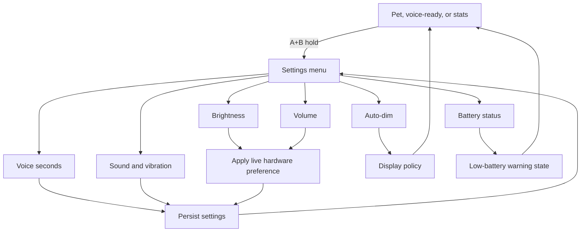

# feat: Add device settings and battery status

## Summary

Add a first-class TokenGochi settings area for device preferences: screen brightness, speaker volume, voice recording duration, button feedback, battery status, low-battery warnings, and idle auto-dim. The implementation should adapt the factory StopWatch settings patterns to the current Arduino firmware and current WIP watch UI rather than replacing TokenGochi with the factory ESP-IDF/LVGL app model.

---

## Problem Frame

TokenGochi currently has a hidden settings mode, but it only changes voice recording duration. The factory StopWatch firmware presents settings as a device-level area with large touch controls for brightness, volume, button feedback, date/time, and device/about information. TokenGochi needs the same kind of practical device settings while preserving the pet-first UI and the current voice-mode separation.

The user specifically wants settings beyond transcription seconds and wants battery visibility, with low-battery warnings and auto-dim behavior in scope. The plan treats the restored current WIP watch screen as the baseline and does not reuse the old clean-branch screen.

---

## Requirements

- R1. Settings must include the existing voice recording duration choices so no current settings behavior is lost.
- R2. Settings must include screen brightness as a persisted user preference.
- R3. Settings must include speaker volume as a persisted user preference that affects chirps and user-facing audio feedback.
- R4. Settings must include button feedback controls for sound and vibration, matching the factory firmware concept at TokenGochi scale.
- R5. Settings must show battery status, including percentage when available, voltage for diagnostic context, and charging/discharging/unknown state.
- R6. The device must surface low-battery warnings without interrupting recording, transcription, reset confirmation, or transcript reading.
- R7. Auto-dim behavior must be configurable and must wake back to the user-selected brightness on interaction.
- R8. Settings must fit the 466x466 round AMOLED and current TokenGochi visual language, with no dependency on invisible corners.
- R9. Settings must persist across reboot without storing secrets or backend data.
- R10. Firmware-visible behavior must be verified on the physical StopWatch with flash, serial evidence, and screenshot capture when hardware is available.

---

## Scope Boundaries

### In Scope

- A settings menu or dashboard reachable from the existing settings chord.
- Adjustment screens or touch controls for brightness, volume, voice duration, button sound, vibration, and auto-dim.
- A battery/status page inside settings.
- Low-battery warning affordances on safe screens.
- Auto-dim in safe idle-like states.
- Firmware documentation and interaction docs for the new settings model.

### Deferred to Follow-Up Work

- Full display sleep or deep power-management policy. The prior power-efficiency plan remains the right place for broader sleep, Wi-Fi power-save, and current measurement work.
- Manual time/date editing. The factory firmware has date/time settings, but TokenGochi currently syncs useful time from backend state and manual RTC editing is a separate UX and persistence problem.
- Cloud-synced settings shared across devices.
- Production/staging backend changes.

### Outside This Change

- Replacing the current Arduino firmware with the factory ESP-IDF/LVGL firmware architecture.
- Redesigning the pet home screen or changing token/mood semantics.

---

## High-Level Technical Design

The settings model should be independent from the visual menu. Settings storage owns defaults, validation, and persistence. UI code reads a snapshot and emits user intentions. Hardware adapters apply display brightness, speaker volume, vibration, and dimming rules.

---

## Key Technical Decisions

- KTD1. Adapt the factory settings concepts, not the factory app framework: The official StopWatch UserDemo uses ESP-IDF, LVGL, worker objects, and a HAL. TokenGochi is Arduino/M5Unified with hand-drawn round UI, so the plan borrows behavior and ranges while keeping local architecture.
- KTD2. Use persisted settings through an Arduino-friendly NVS wrapper: The factory firmware stores settings in NVS. TokenGochi should do the same through a small firmware-local abstraction, with pure validation helpers covered by native tests.
- KTD3. Keep percentages user-facing and map to hardware ranges at the edge: Brightness and volume should display as 0-100 style values like the factory firmware. Hardware calls can map brightness and speaker volume to M5Unified's 0-255 APIs.
- KTD4. Treat battery percentage as best-effort status, not precise fuel-gauge truth: M5Unified exposes battery level, voltage, current, and charging state, but the plan should show voltage and charging state to make uncertainty visible.
- KTD5. Make low-battery warnings non-modal by default: TokenGochi should warn on glanceable screens and in settings, but it should not steal focus from recording, transcribing, reset confirmation, or transcript reading.
- KTD6. Implement auto-dim before display sleep: Dimming is lower risk than sleeping the AMOLED panel because it preserves screen context and avoids touch-wake uncertainty. Full sleep belongs with the broader power-efficiency work.
- KTD7. Apply settings immediately, save intentionally: Brightness and volume should preview live while changing, then save on explicit selection or leaving the adjustment screen. This mirrors the factory firmware's live preview plus OK/save model.

---

## Acceptance Examples

- AE1. Starting from pet home, hold KEYA+KEYB. The watch opens a settings menu instead of jumping directly to voice duration choices.
- AE2. In settings, select brightness and change it. The screen brightness changes immediately, the chosen value is saved, and after reboot the same brightness is applied during setup.
- AE3. In settings, set volume to zero. Success/error chirps become silent or effectively muted while visual/vibration feedback remains available when enabled.
- AE4. In settings, change voice duration to 20 seconds. A later recording auto-stops at 20 seconds and the setting survives reboot.
- AE5. In settings, open battery status while on USB. The page shows charge state and voltage, and does not claim unsupported readings as precise.
- AE6. When battery falls below the low threshold on the home screen, the watch shows a low-battery warning without navigating away from the pet.
- AE7. When the device is idle past the configured auto-dim timeout, the display dims. A button or valid touch interaction restores the selected brightness before the normal action is processed.
- AE8. While recording, transcribing, reading a transcript, or confirming reset, low-battery warnings and auto-dim do not obscure the active workflow.

---

## Implementation Units

### U1. Settings Model and Persistence

**Goal:** Add a typed settings model with defaults, validation, migration/versioning, and persistent storage.

**Requirements:** R1, R2, R3, R4, R7, R9

**Dependencies:** None

**Files:** `firmware/src/device_settings.h`, `firmware/src/device_settings.cpp`, `firmware/test/test_device_settings.cpp`, `firmware/platformio.ini`

**Approach:** Create a small firmware-local settings module that owns the supported values: recording duration, brightness percent, volume percent, button sound enabled, vibration enabled, auto-dim mode, and warning enabled. Keep hardware out of this module. Use clamping/snap helpers so invalid persisted values cannot leak into UI or hardware calls. Use a versioned namespace so future settings can migrate without erasing everything.

**Execution note:** Add pure validation tests before wiring the settings model into `main.cpp`.

**Patterns to follow:** Existing `clampRecordSeconds()` semantics in `firmware/src/main.cpp`; factory firmware's NVS-backed `Settings` helper; current config/default constants in `firmware/src/config.h`.

**Test scenarios:**

- Happy path: default settings load when NVS has no value, with recording duration 10 seconds and sensible brightness/volume defaults.
- Happy path: recording duration accepts only 10, 20, and 30 seconds and snaps invalid values to the nearest supported option.
- Happy path: brightness clamps to the supported visible range and volume clamps to 0-100.
- Edge case: corrupt or out-of-range persisted values are normalized before being returned to callers.
- Edge case: a future version number does not crash older firmware and falls back to known fields.
- Failure path: storage read failure returns defaults and logs the issue without blocking boot.

**Verification:** Unit tests cover normalization and defaults, and a firmware build still succeeds with the new storage module included.

### U2. Hardware Application Layer

**Goal:** Apply user settings to display brightness, speaker volume, chirp/vibration feedback, and voice duration without scattering hardware calls through the state machine.

**Requirements:** R1, R2, R3, R4, R7

**Dependencies:** U1

**Files:** `firmware/src/device_settings.h`, `firmware/src/device_settings.cpp`, `firmware/src/audio.h`, `firmware/src/audio.cpp`, `firmware/src/ui.h`, `firmware/src/ui.cpp`, `firmware/src/main.cpp`, `firmware/test/test_device_settings.cpp`

**Approach:** Add narrow apply helpers that map user-facing percentages to M5Unified hardware values. Brightness should use `M5.Display.setBrightness()` or a UI wrapper. Volume should use `M5.Speaker.setVolume()` when the speaker is active and should also affect future chirps. Button sound and vibration settings should gate the existing success/failure chirp and vibration call sites.

**Patterns to follow:** Existing `chirpOk()` / `chirpFail()` and vibration call sites in `firmware/src/main.cpp`; current `audio::chirp()` speaker abstraction; M5Unified `M5.Display.setBrightness()` and `M5.Speaker.setVolume()`.

**Test scenarios:**

- Happy path: applying 80% brightness maps to a nonzero display brightness value and updates the cached setting.
- Happy path: applying 0% volume mutes chirp volume while still allowing non-audio visual feedback.
- Edge case: brightness never maps to zero during normal bright mode unless the implementation is deliberately sleeping the display.
- Failure prevention: disabling button sound suppresses chirps but does not suppress required recording/transcription logic.
- Failure prevention: disabling vibration skips haptic feedback but does not alter reset, settings-save, or transcription state transitions.

**Verification:** Firmware build passes, serial logs show settings apply events, and physical-device checks prove brightness and feedback settings visibly/audibly change behavior.

### U3. Round Settings Menu and Adjustment Screens

**Goal:** Replace the single-purpose duration settings view with a settings menu that exposes the full device settings set.

**Requirements:** R1, R2, R3, R4, R5, R7, R8

**Dependencies:** U1, U2

**Files:** `firmware/src/ui.h`, `firmware/src/ui.cpp`, `firmware/src/main.cpp`, `firmware/test/test_device_settings.cpp`

**Approach:** Extend the current `SETTINGS` mode into a small settings state machine. The first settings screen should show large, round-safe entries. Touch selects an entry; KEYB cycles focus or values; KEYA backs out. Adjustment screens should use large value text and slider/stepper-style affordances adapted to the round display. The voice-duration circles can remain as a specialized adjustment screen.

**Patterns to follow:** Current `drawDurationSettings()` / `durationFromTouch()` interaction; factory firmware's large settings list and percentage adjustment screens; current round-safe text helpers in `firmware/src/ui.cpp`.

**Test scenarios:**

- Happy path: KEYA+KEYB from pet, voice-ready, or stats opens the settings menu.
- Happy path: touch selects each visible settings entry without relying on screen corners.
- Happy path: KEYB-only navigation can reach and change every setting for fallback use.
- Edge case: leaving settings through KEYA returns to pet home with the current setting snapshot applied.
- Edge case: settings timeout returns to pet home without corrupting partially previewed values.
- Regression path: current 10/20/30 second touch controls remain available and still save.

**Verification:** Firmware build passes, serial logs show settings menu entry and selected item changes, and TGSHOT screenshots capture the menu plus at least brightness, volume, battery, and auto-dim screens on the physical device.

### U4. Battery Status and Low-Battery Warnings

**Goal:** Add cached battery readings, a battery settings/status page, and low-battery warning state.

**Requirements:** R5, R6, R8, R10

**Dependencies:** U1, U3

**Files:** `firmware/src/battery_status.h`, `firmware/src/battery_status.cpp`, `firmware/src/ui.h`, `firmware/src/ui.cpp`, `firmware/src/main.cpp`, `firmware/test/test_battery_status.cpp`

**Approach:** Sample battery status on a slow cadence and cache the result. Prefer M5Unified battery level when it returns a sane value, keep voltage visible for diagnostics, and record charging state separately. Use conservative thresholds for warnings, with low and critical states. Render warnings only on safe screens, and keep active workflows focused.

**Execution note:** Keep battery classification pure and testable before wiring it into live M5Unified reads.

**Patterns to follow:** M5Unified `M5.Power.getBatteryLevel()`, `getBatteryVoltage()`, `getBatteryCurrent()`, and `isCharging()`; factory firmware's filtered VBAT-to-percent approach; current `ui::drawStatus()` and hint-line patterns.

**Test scenarios:**

- Happy path: a valid battery level and voltage render as percent plus millivolts.
- Happy path: charging state renders separately from percent so USB/charging is clear.
- Edge case: unsupported percentage with valid voltage still shows voltage and `unknown` percent.
- Edge case: noisy readings do not cause warning state to flap every loop.
- Failure prevention: low-battery warning does not display over recording, transcribing, reset confirmation, transcript reading, or settings-save confirmation.
- Failure path: battery API returns zero or negative values and the UI shows unknown rather than false precision.

**Verification:** Firmware build passes, serial logs include sampled battery status, settings screenshot shows battery status, and live-device verification records whether percentage/current readings are `verified` or `not verified` on USB and battery power.

### U5. Auto-Dim Policy

**Goal:** Add configurable idle auto-dim behavior that conserves display power without hiding active workflows.

**Requirements:** R6, R7, R8, R10

**Dependencies:** U1, U2, U4

**Files:** `firmware/src/display_policy.h`, `firmware/src/display_policy.cpp`, `firmware/src/main.cpp`, `firmware/src/ui.h`, `firmware/src/ui.cpp`, `firmware/test/test_display_policy.cpp`

**Approach:** Track last user interaction centrally and classify modes where dimming is safe. Auto-dim should lower brightness after the configured timeout in pet idle, voice-ready, and optionally stats. It should restore the user-selected brightness on the next interaction before normal button/touch behavior proceeds. Critical battery state may shorten the dim timeout or clamp the dim brightness, but it should not dim active workflows.

**Execution note:** Add pure policy tests for mode safety and timing before integrating M5 display calls.

**Patterns to follow:** Existing `Mode` enum and state-machine switch in `firmware/src/main.cpp`; prior power-efficiency plan's separation between product mode and display policy; M5GFX brightness controls.

**Test scenarios:**

- Happy path: after the configured idle timeout, the display dims in pet idle.
- Happy path: a button press after dimming restores full brightness before the requested action happens.
- Edge case: repeated blink redraws do not reset the interaction timer.
- Edge case: settings, recording, transcribing, transcript/history reading, reset confirmation, settings-save, and error screens are not dimmed.
- Battery path: critical battery state applies the stronger dim policy only on safe screens.
- Failure prevention: auto-dim disabled means no brightness change from idle timing.

**Verification:** Unit tests cover policy classification and timing, firmware build passes, serial logs show dim/restore transitions, and physical-device observation verifies dimming because TGSHOT cannot prove panel brightness.

### U6. Documentation and Device Verification

**Goal:** Update user-facing firmware docs and verify the settings workflows on the actual StopWatch.

**Requirements:** R1, R2, R3, R4, R5, R6, R7, R8, R10

**Dependencies:** U2, U3, U4, U5

**Files:** `firmware/README.md`, `README.md`, `docs/device-interactions.html`, `STATUS.md`

**Approach:** Document the settings entry path, per-setting controls, battery-status caveats, low-battery warnings, and auto-dim behavior. Keep the docs aligned with the current button model: KEYA is back/home, KEYB advances/cycles/enters, touch selects visible controls. Verification should include build, flash, serial logs, screenshot capture, and live visual checks for brightness/dim behavior.

**Patterns to follow:** Existing interaction tables in `firmware/README.md`; AGENTS.md firmware verification standard; `tools/capture-device-screen.mjs` screenshot workflow.

**Test scenarios:**

- Documentation: interaction docs list every settings control and do not describe the old duration-only settings screen as complete.
- Documentation: battery wording says `not verified` when live device readings are unsupported or only observed under USB.
- Documentation: auto-dim verification notes distinguish framebuffer evidence from physical brightness observation.

**Verification:** Docs match the implemented behavior, firmware build passes, the physical StopWatch is flashed, and screenshots are captured for the settings menu and changed views.

---

## System-Wide Impact

The active work is firmware-scoped. It does not require bridge, Cloudflare, D1, or deployment changes. It does affect user-visible button/touch behavior, boot-time device setup, audio feedback, display behavior, and firmware documentation.

Persistent settings add local device state. The implementation must avoid storing Wi-Fi secrets, bearer tokens, transcripts, backend responses, or production/staging data in the settings namespace.

---

## Risks & Dependencies

- **Dirty WIP baseline:** The current checkout contains active UI/sprite work. Implementation must start from the restored WIP checkout, not the isolated power-efficiency worktree.
- **Battery precision:** The StopWatch exposes battery APIs through M5Unified and M5PM1, but readings may differ on USB vs battery. The UI should show status conservatively and verification must report unsupported readings as `not verified`.
- **Brightness verification:** TGSHOT captures framebuffer pixels, not physical panel luminance. Brightness and auto-dim need live visual observation, serial logs, or current measurement.
- **Audio muxing:** M5 mic and speaker share codec resources. Volume changes must not break recording, transcription, or chirp feedback.
- **Touch targets:** The round AMOLED has invisible corners. Settings controls must remain centered and round-safe.
- **Flash wear:** Settings should save on intentional changes, not every loop tick or every slider preview update.

---

## Sources & Research

- Current firmware settings mode: `firmware/src/main.cpp`, `firmware/src/ui.cpp`, `firmware/src/audio.cpp`, `firmware/README.md`.
- Current M5Unified/M5GFX APIs in PlatformIO dependencies: `firmware/.pio/libdeps/m5stack-stopwatch/M5Unified/src/utility/Power_Class.cpp`, `firmware/.pio/libdeps/m5stack-stopwatch/M5Unified/src/utility/Speaker_Class.hpp`, `firmware/.pio/libdeps/m5stack-stopwatch/M5GFX/src/lgfx/v1/LGFXBase.hpp`.
- Official factory firmware repository: [m5stack/M5StopWatch-UserDemo](https://github.com/m5stack/M5StopWatch-UserDemo).
- Factory settings worker patterns: [device.cpp](https://github.com/m5stack/M5StopWatch-UserDemo/blob/main/main/apps/app_setup/workers/device.cpp).
- Factory display and settings persistence patterns: [hal_display.cpp](https://github.com/m5stack/M5StopWatch-UserDemo/blob/main/main/hal/hal_display.cpp), [settings.h](https://github.com/m5stack/M5StopWatch-UserDemo/blob/main/main/hal/utils/settings/settings.h), [settings.cc](https://github.com/m5stack/M5StopWatch-UserDemo/blob/main/main/hal/utils/settings/settings.cc).
- Factory PMIC battery behavior: [hal_pmic.cpp](https://github.com/m5stack/M5StopWatch-UserDemo/blob/main/main/hal/hal_pmic.cpp).
- Factory firmware usage guide: [StopWatch Factory Firmware Tutorial](https://docs.m5stack.com/en/guide/display_device/stopwatch/usage).
